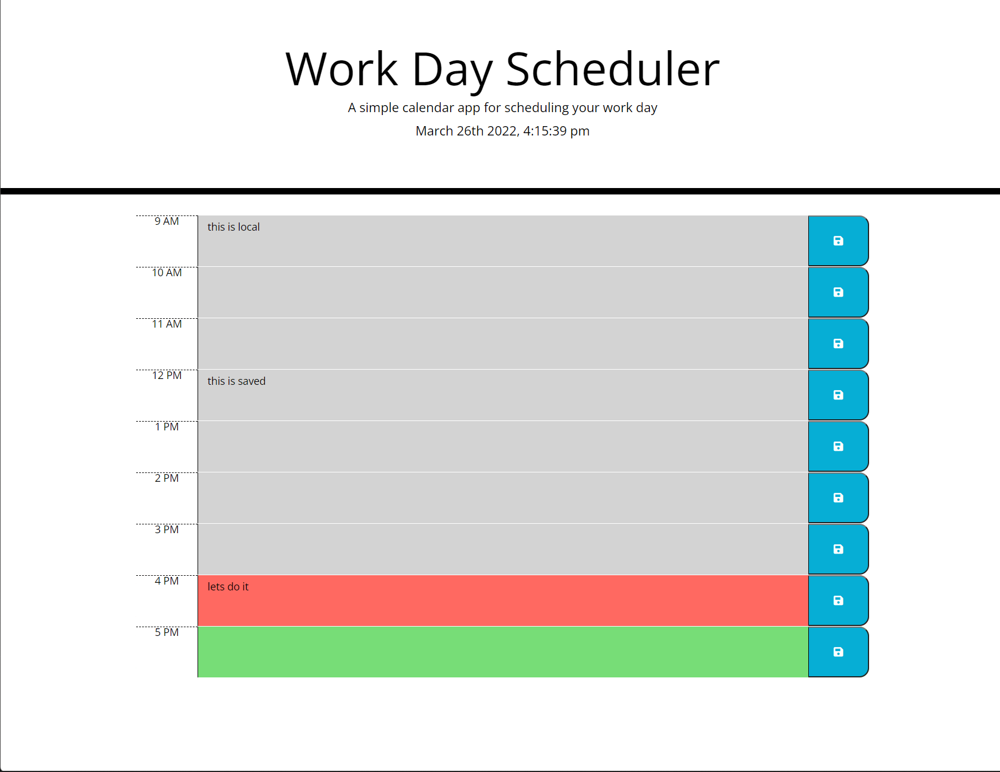
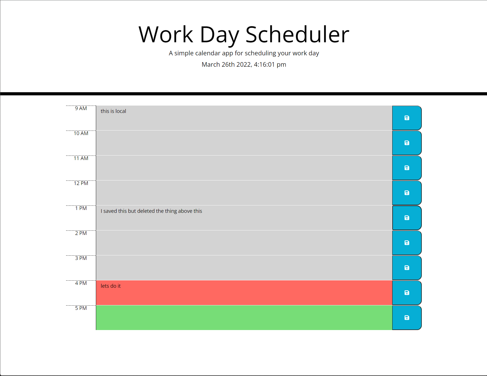

# work-day-scheduler
in this assignment I learned how to add time in different formats, how to keep them going per interval
also had a chance to use (this) a bit more, along with things like siblings and parent. I've got a slightly better understanding of jquery and local storage now.

### website deployment
click link provided for deployed web application

click the timeblock you wish to add something to

after typing  click save button to the right of box

refresh screen and saved element will remain

## links

[deployed-Web-App](https://batemanz.github.io/work-day-scheduler/)

[GitHub-Repository](https://github.com/batemanz/work-day-scheduler.git)

## images

